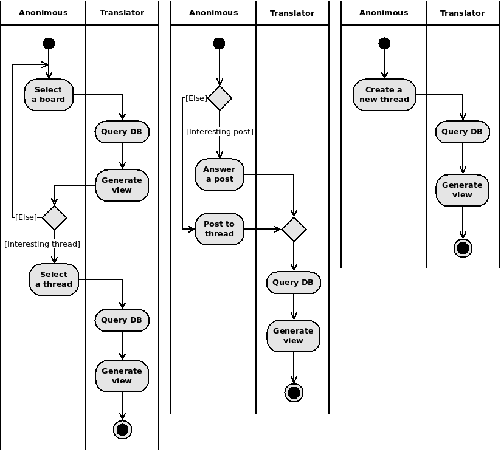

# imageboard

Practice project

## System's context

1. Actors:
   - Anonymous
1. Use cases:
   - Check the thread of interest
   - Post to the thread of interest
   - Start a new thread

### Use case specification

__Use case name__: Check the thread of interest\
__Use case purpose__: Boards and threads constitute the imageboard. The usecase provides ability for an Actor to navigate hierarchy and view the contents of particular element.

Optimistic flow:

1. Check the main
1. Check the board
1. Check the contents of a thread

Pragmatic flow:

&ensp;Conditions trigerring alternate flow:\
&emsp;Condition 1: There is no threads of interest on the board.\
&emsp;&ensp;2-1. Provide ability to navigate to another board

__Use case name__: Post to the thread of interest\
__Use case purpose__: The usecase provides ability for an Actor to make a post

Optimistic flow:

1. Check the posts in a thread of interest
1. Post an answer to the post of interest

Pragmatic flow:

&ensp;Conditions trigerring alternate flow:\
&emsp;Condition 1: There is no post of interest\
&emsp;&ensp;2-1. Provide ability to post to the root of a thread

__Use case name__: Start a new thread\
__Use case purpose__: The usecase provides ability for an Actor to create a new thread

Optimistic flow:

1. Check the main
1. Make a new thread

### Activity

